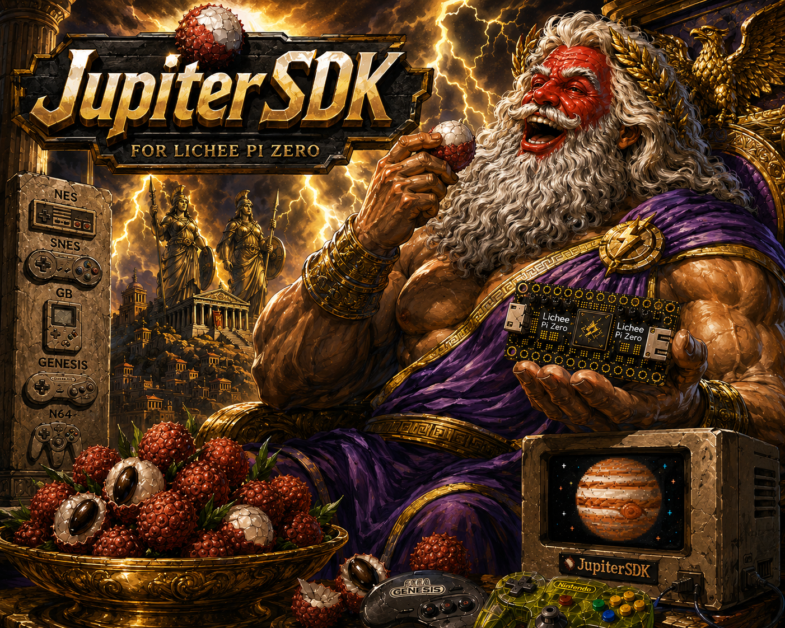

<div align="center">



**Bare-metal game development kit for the Lichee Pi Zero (Allwinner V3s).**
</div>

---

## What you get

- **Hardware-accelerated 2D pipeline** — VI0 (game, double-buffered),
  VI1 (sprite), UI0 (overlay, double-buffered) composited by the DE2
  mixer. NEON-optimized framebuffer fills (1.2 GB/s) and sprite blits.
- **Audio stack** — 4-channel 48 kHz PCM mixer; NES APU + GameBoy APU
  + SC-55 MIDI emulator (Nuked-SC55) + MT-32 emulator (Munt) + Genesis
  FM (Nuked-OPN2). Single-call bring-up via `audio_quickstart()`.
- **MIDI I/O** — UART1 at 31250 baud on PE21/PE22, opto-isolated DIN-5
  IN/OUT, IRQ-driven RX ring buffer, SysEx assembler. Software-side
  only so far — no breakout has been wired yet; wire-level send /
  receive is unverified. See [`docs/MIDI_HW_GUIDE.md`](docs/MIDI_HW_GUIDE.md)
  for the BOM and bring-up plan, and [`LIMITATIONS.md`](LIMITATIONS.md)
  for what's verified vs unverified across the SDK.
- **MIDI hardware editors** — SysEx editors for Yamaha FB-01, Roland
  MT-32, and PPG WaveTerm / Behringer Wave. UIs run; SysEx packets
  build correctly and log to UART0. Driving the actual synths waits
  on the MIDI breakout.
- **Retro PPU renderers** — NES, SNES (all 8 modes), Genesis VDP,
  Game Boy / GBC.
- **CedarVE H.264 codec** — I-frame decode + NV12→ARGB conversion;
  encoder (I-frame) used by the `cedar_snes` example pipeline.
- **Storage** — block-level SDMMC driver, vendored ChaN FatFs (R0.15a),
  N64 Controller Pak filesystem (Nintendo-compatible note format,
  verified against real carts).
- **Controllers** — NES, SNES, Genesis (3-button + 6-button), N64
  (digital + analog stick) over GPIO bit-bang.
- **Warcraft 1 port** — Stratagus + War1gus (~100k lines of upstream
  C++ + Lua) plays end-to-end on real silicon.
- **QEMU emulator** — `licheeEmu` device models for Lichee Pi Zero;
  run any `jupiter.bin` on a host PC.

## First time?

Start at **[`docs/GETTING_STARTED.md`](docs/GETTING_STARTED.md)** —
a single linear page from "I just heard about this" to "the LCD
shows the color bars example." Covers what to buy, how to wire it,
how to install the toolchain on Linux / macOS / WSL, building
U-Boot, partitioning the SD card, and first-boot verification.

## Once everything is set up

```bash
# Build any example
make GAME=examples/parallax/main.c

# Generate the U-Boot boot script (one-time, requires u-boot-tools)
make boot

# Copy boot.scr + jupiter.bin to the FAT boot partition of your SD card
make sdcard MNT=/mnt
```

## Hardware

| Component | Detail |
|---|---|
| **SoC** | Allwinner V3s (Cortex-A7 single-core @ 1.2 GHz, NEON, VFPv4) |
| **DRAM** | 64 MB DDR2 |
| **GPU/Display** | DE2 mixer: VI0 (game, double-buffered) + VI1 (sprite) + UI0 (overlay, double-buffered), hardware blender |
| **Codec** | CedarVE (H.264 decode + encode) |
| **Audio codec** | On-die DAC, 16- or 24-bit, programmable rate (table-driven PLL) |
| **Reference panel** | 480×272 RGB parallel TFT (HY0430IPS04-04 or compatible) |
| **Boot board** | Lichee Pi Zero |
| **Serial** | UART0 @ 115200 8N1 (PB8 = TX, PB9 = RX) |
| **MIDI** | UART1 @ 31250 baud (PE21 = TX, PE22 = RX) — opto-isolated DIN-5 IN/OUT (see [`docs/MIDI_HW_GUIDE.md`](docs/MIDI_HW_GUIDE.md)) |
| **Controllers** | NES / SNES / Genesis / N64 via GPIO bit-bang (see [`docs/PIN_OVERLAYS.md`](docs/PIN_OVERLAYS.md)) |

## Documentation

### Reference (start here)

| Document | Purpose |
|---|---|
| [`docs/GETTING_STARTED.md`](docs/GETTING_STARTED.md) | **Read this first** — zero-to-color-bars walkthrough for a new user. |
| [`docs/JUPITER_HARDWARE_REFERENCE.md`](docs/JUPITER_HARDWARE_REFERENCE.md) | Complete V3s memory map, CCU, GPIO, TCON, DE2, display init. |
| [`docs/GAME_DEV_TRICK_BIBLE.md`](docs/GAME_DEV_TRICK_BIBLE.md) | 15-chapter cookbook: DMA, NEON, layer compositing, scaler, double-buffer, tiles, sprites, dirty rects, cache, audio, raster effects. |
| [`docs/CEDARVE_AND_RETRO_PIPELINES.md`](docs/CEDARVE_AND_RETRO_PIPELINES.md) | Hardware H.264 codec + Genesis/NES/GB/SNES rendering pipelines. |
| [`docs/HSTIMER_AND_HDMA.md`](docs/HSTIMER_AND_HDMA.md) | Scanline-accurate raster interrupts. |
| [`docs/UBOOT_SPL_GUIDE.md`](docs/UBOOT_SPL_GUIDE.md) | First-time boot setup. |
| [`docs/WIRING_GUIDE.md`](docs/WIRING_GUIDE.md) | Pinouts, controller wiring, audio mixing, backlight. |
| [`docs/PIN_OVERLAYS.md`](docs/PIN_OVERLAYS.md) | GPIO overlay configurations. |
| [`docs/MIDI_HW_GUIDE.md`](docs/MIDI_HW_GUIDE.md) | MIDI breakout BOM + wiring + bring-up + loopback verification. |
| [`docs/SHOPPING_LIST.md`](docs/SHOPPING_LIST.md) | Hardware BOM. |
| [`LIMITATIONS.md`](LIMITATIONS.md) | Caveats, known issues, what the SDK does NOT cover. |

### Ports

- [`docs/ports/WC1_BUILD_GUIDE.md`](docs/ports/WC1_BUILD_GUIDE.md) —
  How to extract WC1 assets via War1gus and build the war1 example.
- [`docs/ports/WC1_PORT_AUDIT.md`](docs/ports/WC1_PORT_AUDIT.md) —
  Subsystem-by-subsystem status: upstream verbatim vs. modified /
  stubbed.
- [`docs/ports/WC1_PORTING_OTHER_STRATAGUS_GAMES.md`](docs/ports/WC1_PORTING_OTHER_STRATAGUS_GAMES.md) —
  What would change to port Wargus / other Stratagus games on top
  of the Jupiter scaffolding.

### Devlog (historical)

- [`docs/devlog/`](docs/devlog/) — Working notes, brainstorms, status
  reports, reverse-engineering findings. Useful as lore when something
  breaks; not part of the user-facing documentation.

## Examples

The `examples/` directory ships **60 reference programs**, grouped:

**Display & graphics** — `colorbars`, `bouncing_sprite`, `sprites`,
`fast_tiles`, `parallax`, `parallax_all`, `parallax_test`, `mode1`,
`mode2`, `mode7_neon`, `mode7_vortex`, `mode7_sprites`, `isometric`,
`isometric_fullres`, `trilayer`, `jupiter_logo`, `jupiter_moon`.

**PPU renderers** — demos of the bundled retro renderers in `lib/`:
- `nes_ppu` — NES PPU at native 256×224 (Mendel Palace sprites)
- `gb_ppu` — GB PPU at native 160×144 (Pokemon Crystal animation)
- `snes_showcase` — SNES PPU across all 8 modes
- `genesis_vdp` — Genesis VDP: Plane A + Plane B + Window + sprites,
  authentic 320×224
- `cedar_snes` — CedarVE H.264 encode → decode → SNES tile pipeline
- `cedar_genesis` — CedarVE H.264 decode → scale → Genesis VDP
  metasprite

**Audio** — `opn2_rt`, `opn2_input`, `opn2_jupiter`, `opn2_megademo`,
`opn2_hw_*` (gb / nes / live / input / xtal — drive a real YM3438),
`mt32_rt`, `mt32_poc`, `mt32_monkey`, `sc55_warcraft`,
`input_mt32`, `ym3438`.

**MIDI hardware editors** — SysEx editors driving real UART1 MIDI:
- `fb01_editor` — Yamaha FB-01 (FM)
- `mt32_editor` — Roland MT-32 (LA synthesis, partial editor)
- `waveterm` — PPG WaveTerm / Behringer Wave
- `waveterm_vdp` — Genesis VDP rewrite of the WaveTerm UI; tile +
  nametable rendering, 4-px packed font. Prototype for an eventual
  Sega Genesis port.

**Video** — `cedar_video` (H.264 decode), `cedar_video_av` (H.264 +
audio sync), `cedar_decode_test` (small H.264 I-frame decode probe),
`av_demo` (multi-system audio + visuals showcase).

**Storage** — `sdmmc`, `sdmmc_music`, `fs_test`, `cpak_browser`,
`wc1_save` (Controller Pak + SD raw-block save round-trip).

**Diagnostics** — `benchmark`, `mmu_dcache`, `sram_bench`,
`scaler_probe`, `hdma_bench`, `hstimer_raster`, `input_test`.

**Full port** — `war1` (Warcraft 1 / Stratagus + War1gus, end-to-end
playable on real silicon).

**Launcher** — `menu` (boots into a chooser that runs any of the
above; auto-bundles the examples it knows about).

Each example builds with `make GAME=examples/<name>/main.c`.

## Library API

```c
#include "jupiter.h"

/* ---- Display ---- */
video_init();
video_set_overlay(g_war1_back_fb);
video_wait_vblank();

/* ---- MMU + cache ---- */
mmu_init();
dcache_clean_fb(FB0_ADDR);
dcache_clean_range(addr, size);

/* ---- Drawing ---- */
memset32_neon(FB0_ADDR, 0xFF000000, LCD_W * LCD_H * 4);
sprite_blit(ovl, LCD_W, src, w, h, dx, dy);
tiles_render_fast(fb, LCD_W, map, map_w, color_lut, 0, rows, scroll_x);

/* ---- Audio (one-call bring-up) ---- */
audio_quickstart(48000);
irq_global_enable();
audio_pcm_play_rate(0, samples, len, vol, loop, src_rate);

/* ---- Cedar H.264 ---- */
cedar_init();
cedar_h264_decode(nal, len, w, h, hdr_bits, qp, 0, 0, 0);
cedar_nv12_to_argb(fb + dst_y * LCD_W + dst_x, LCD_W, w, h);

/* ---- Storage ---- */
sdmmc_init();
sdmmc_read_blocks(lba, count, dst);

/* ---- Input ---- */
input_init(INPUT_N64);
input_state_t st = input_poll();
if (input_pressed() & BTN_A) { ... }

/* ---- MIDI (UART1 @ 31250 baud, DIN-5 IN/OUT) ---- */
midi_init();
midi_send(sysex_bytes, len);            /* TX, blocking */
midi_sysex_set_handler(on_sysex_in);    /* RX callback per F0..F7 packet */
midi_pump();                             /* call each frame to drain RX */

/* ---- Timer ---- */
timer_init();
uint32_t t0 = timer_read();
uint32_t us = ticks_to_us(timer_elapsed(t0, timer_read()));
```

Full surface in [`include/jupiter.h`](include/jupiter.h),
[`include/input.h`](include/input.h), [`include/sdmmc.h`](include/sdmmc.h),
[`include/hstimer.h`](include/hstimer.h), [`include/midi.h`](include/midi.h),
[`include/cpak.h`](include/cpak.h), [`include/cpakfs.h`](include/cpakfs.h).

## Performance highlights

| Operation | Measurement |
|---|---|
| NEON framebuffer fill (full screen) | 425 µs (1.23 GB/s) |
| Scalar fill (full screen) | 2,920 µs (179 MB/s) |
| D-cache flush (full FB) | 57 µs |
| Sprite blit (25 sprites, alpha-key) | 0.9 ms |
| Parallax tiles (fast LUT renderer) | 7.8 ms / frame |
| Mode 7 vortex (sky + floor + sprite) | 15.9 ms / frame |
| Mode 7 + 25 sprites (tear-free) | 13.0 ms / frame |
| Frame budget @ 60 fps | 16,667 µs |

See [`docs/devlog/PROGRESS.md`](docs/devlog/PROGRESS.md) for the full
historical benchmark log.

## Project structure

```
.
├── include/                        public headers (jupiter.h, input.h, …)
├── lib/                            SDK runtime (audio, video, cedar, sdmmc, …)
├── scripts/                        startup + linker + asset pipelines
├── template/                       starting-point game stub
├── examples/                       61 reference programs
├── docs/
│   ├── (reference docs)
│   ├── devlog/                     historical notes
│   └── ports/                      game / engine ports
├── third_party/                    vendored: dlmalloc, FatFs, guisan, ne10,
│                                   munt (MT-32), nuked_sc55, nuked_opn2,
│                                   stratagus, lua, fonts
├── tools/                          renderers, codec helpers
├── emulator/                       licheeEmu — QEMU device models for
│                                   Lichee Pi Zero (V3s). Run jupiter.bin
│                                   on a host PC byte-identical to real HW.
├── JupiterSDK-2.png                logo
├── LIMITATIONS.md                  caveats + known issues
└── README.md
```

## Emulator

The `emulator/` directory ships **licheeEmu** — a small set of QEMU device
models for the Lichee Pi Zero (Allwinner V3s). Drop them into a stock
QEMU 9.2.x source tree, build, and run any `jupiter.bin` exactly as the
real board would. See [`emulator/README.md`](emulator/README.md) and
[`emulator/docs/BUILD.md`](emulator/docs/BUILD.md).

## License

The Jupiter SDK runtime (everything under `lib/`, `include/`,
`scripts/`, `template/`, `examples/`) is provided as-is; see individual
files for licensing notes where required. Vendored third-party code
retains its upstream licenses:

- **Under `third_party/`** — Lua (MIT), ChaN FatFs (BSD-2),
  Munt / mt32emu (GPLv3), Nuked-SC55 (GPLv3), Stratagus + War1gus
  (GPLv2), dlmalloc (public domain), ne10 (BSD), guisan (BSD),
  toluapp (MIT), math_neon (BSD), libcedarc / cedar (LGPLv2.1).
- **Under `libvgm/`** — Nuked-OPN2 + various libvgm chip emulators
  (GPLv2 / Apache-2.0 / individual headers — see file headers).
- **Under `lib/arm_opt/`** — ARM optimized-routines (MIT).

Game assets (Warcraft 1, War1gus tilesets/audio/cinematics) are NOT
distributed — provide your own copy of `data.War1gus/` to build the
WC1 port.

## Philosophy

This project exists because the fifth-generation console
philosophy — dedicated processors, bare-metal code, hardware as creative
constraint — deserved to keep evolving. The Jupiter SDK is not retro.
It is the road not taken, continued.

Four chips. No OS. Every watt serves the game.
